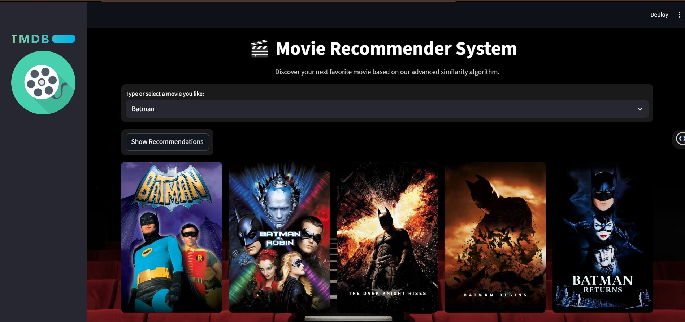

# 🎬 Movie Recommender System


> A content-based movie recommendation web app that suggests 10 similar movies using Cosine Similarity, fetches real-time posters via the TMDB API, and presents them in a modern Glassmorphism UI.

---

## 📸 Screenshots

**🏠 Home — Select a movie and get recommendations**


**🔎 Search — Type to filter from thousands of movies**


**🎥 Results — 10 similar movies with live posters in a grid**


> Select any movie → click **Show Recommendations** → get 10 similar movies with posters instantly.

---

## ✨ Features

- 🔍 **Content-Based Filtering** — Recommends movies based on similarity in genres, cast, crew, and keywords
- 🎯 **Cosine Similarity** — Uses vectorized movie metadata for fast and accurate matching
- 🖼️ **Live Movie Posters** — Fetches real-time poster images from the TMDB API
- 🎨 **Glassmorphism UI** — Cinematic HD background with frosted-glass styled components
- ⚡ **Streamlit Powered** — Runs as a responsive, interactive web app in the browser
- 📦 **Pre-processed Data** — Pickle files for instant loading with no re-computation needed

---

## 🛠️ Tech Stack

```
Python 3.x
├── streamlit          # Web app framework
├── pandas             # Data handling
├── scikit-learn       # Cosine similarity computation
├── requests           # TMDB API calls
└── pickle             # Serialized model & data loading
```

**External API:** [TMDB (The Movie Database)](https://www.themoviedb.org/)

---

## 📂 Project Structure

```
Movies-Recommendation-System/
│
├── app.py                  # Main Streamlit application
├── movies_dict.pkl         # Pre-processed movies dictionary (title, movie_id, etc.)
├── similarity.pkl          # Pre-computed cosine similarity matrix
├── my_processed_data.csv   # Cleaned & processed movie dataset
├── requirements.txt        # Python dependencies
├── setup.sh                # Shell script for environment setup
├── .gitignore              # Git ignored files
└── README.md               # Project documentation
```

---

## ⚙️ How It Works

1. **Data Preprocessing** — Movie metadata (genres, cast, keywords, crew) is cleaned and combined into feature tags
2. **Vectorization** — Tags are converted into numerical vectors using `CountVectorizer`
3. **Similarity Matrix** — Cosine similarity is computed between all movie vectors
4. **Recommendation** — For a selected movie, the top 10 most similar movies are retrieved
5. **Poster Fetching** — TMDB API is called with each movie's ID to get the poster image URL
6. **Display** — Results are shown in a 5-column grid with movie titles and posters

---

## 🚀 Getting Started

### Prerequisites
- Python 3.7+
- A [TMDB API Key](https://www.themoviedb.org/settings/api) (free account required)

### 1. Clone the Repository
```bash
git clone https://github.com/Azharaliii/Movies-Recommendation-System.git
cd Movies-Recommendation-System
```

### 2. Install Dependencies
```bash
pip install -r requirements.txt
```

Or install manually:
```bash
pip install streamlit pandas scikit-learn requests
```

### 3. Add Your TMDB API Key

Open `app.py` and replace the API key in the `fetch_poster` function:
```python
url = "https://api.themoviedb.org/3/movie/{}?api_key=YOUR_API_KEY&language=en-US".format(movie_id)
```

### 4. Run the App
```bash
streamlit run app.py
```

The app will open automatically at `http://localhost:8501`

---

## 📋 Requirements

```
streamlit
pandas
scikit-learn
requests
```

> See `requirements.txt` for the full dependency list.

---

## 🔑 API Reference

This project uses the **TMDB API** to fetch movie poster images.

- **Base URL:** `https://api.themoviedb.org/3/movie/{movie_id}`
- **Poster URL:** `https://image.tmdb.org/t/p/w500/{poster_path}`
- **Sign up for a free API key:** [https://www.themoviedb.org/settings/api](https://www.themoviedb.org/settings/api)

---

## 🧠 Algorithm

| Step | Description |
|------|-------------|
| Feature Extraction | Combines genres, cast, keywords, and director into a single tag string |
| Vectorization | `CountVectorizer` converts tags into bag-of-words vectors |
| Similarity | Cosine similarity computed across all movie vectors |
| Recommendation | Top 10 closest neighbors (excluding the selected movie itself) |

---

## 🙏 Acknowledgements

- [TMDB](https://www.themoviedb.org/) for the movie poster API
- [Streamlit](https://streamlit.io/) for the web app framework
- Dataset inspired by the [TMDB 5000 Movie Dataset](https://www.kaggle.com/datasets/tmdb/tmdb-movie-metadata) on Kaggle

---

## 👤 Author

**Azhar Ali Soomro**  
[](https://github.com/Azharaliii)
[](https://www.kaggle.com/azharalisoomro)

---

## 📄 License

This project is open source and available under the [MIT License](LICENSE).

---

⭐ **If you found this helpful, please give it a star!**
